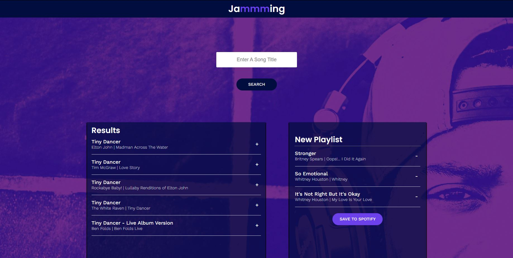

# Jammming!

## Table of contents
* [General info](#general-info)
* [Description](#description)
* [Screenshot](#screenshot)
* [Technolgies](#technolgies)
* [Setup & Start](#setup)
* [Created](#created)
* [License](#license)

## General info 

A web application, built with React and Spotify API, that allows users to search the Spotify library, create a custom playlist, modify exisiting playlists, and then save the playlist to their Spotify accounts. (Requires having a Spotify account for playlists to be saved.)

## Description 

In this Codecademy project, was built a React web application called Jammming. That's use React components, passing state, and requests with the Spotify API to build a website that allows users to search the Spotify library, create a custom playlist, then save it to their Spotify account.

## Screenhot 

## Technolgies 

React - Front End Library
Spotify API

## Setup & Start 

* Clone or download the repo
* Open the directory and run **npm** to install
* Run development application by using **npm start**

## Created 

2023

## License 

Copyright

MIT